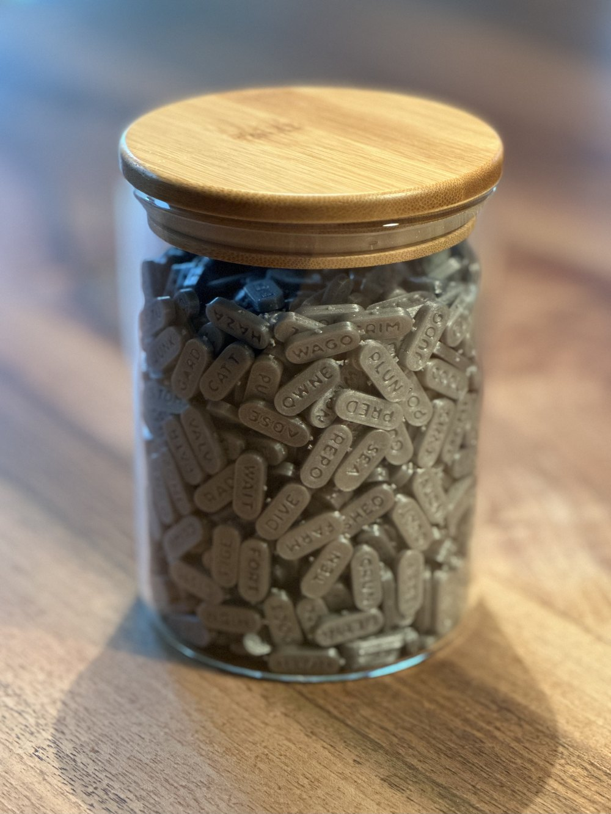
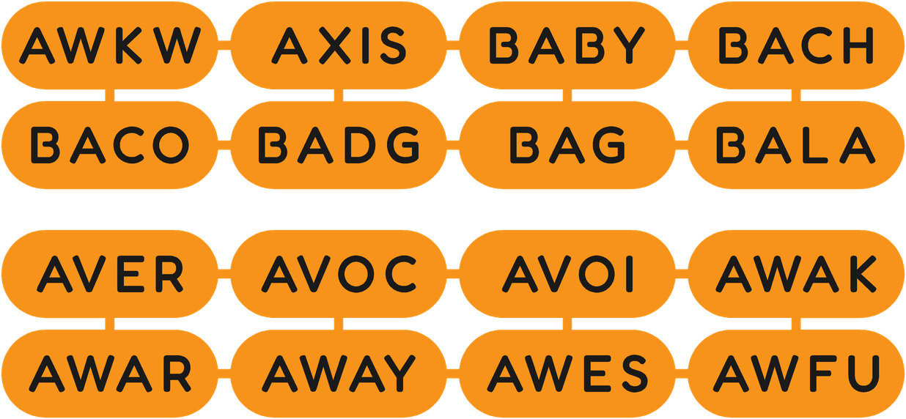

<div align="center">

<picture>
  <source media="(prefers-color-scheme: dark)" srcset="pictures/banner-dark.png">
  
</picture>

[](LICENSE.md)
[](https://github.com/bitcoin/bips/blob/master/bip-0039.mediawiki)
[](https://www.python.org)
[](#printing)



</div>

SeedLottery is a set of 1024 3D-printed tokens that carry all 2048 words of the [BIP39 English word list](https://github.com/bitcoin/bips/blob/master/bip-0039/english.txt), two words per token. You draw tokens from a jar to pick the words of a Bitcoin seed phrase. The randomness comes from your own hands, not from a hardware wallet, an app or anyone else's code.

This repository has the script that generates the tokens for any 3D printer, plus ready-made print files for the Original Prusa MK4S.

## Why

Most people let a hardware wallet or an app generate their seed phrase. That means trusting a random number generator you can't inspect.

In July 2026, Coinkite [disclosed](https://blog.coinkite.com/coldcard-mk3-seed-generation-warning/) that a firmware bug had weakened the seeds generated by Coldcard wallets since 2021. Newer models produced seeds with about 72 bits of entropy instead of 128. Attackers regenerated the private keys offline and stole funds. Seeds created with at least 50 fair dice rolls were not affected.

SeedLottery works like dice rolls, but made for BIP39. You draw one of the 1024 tokens and toss it, and the word that lands face up counts. Both faces have the same shape, so either one lands up about equally often, which makes every one of the 2048 words equally likely: 11 bits per draw. Eleven draws plus part of a twelfth give the full 128 bits of a 12-word phrase. You can watch every step, and nothing depends on someone else's hardware or software.

## Drawing a seed phrase

1. Check that your set is complete. Every token must be there exactly once, because a missing or duplicated token changes the odds of its two words. Compare each printed sheet with its word map before you snap the tokens apart.
2. Put all 1024 tokens in a jar or bag and mix them well.
3. Draw one token without looking and toss it onto the table. The word facing up counts. Write it down.
4. Put the token back and mix again before the next draw. The same word can come up twice; that's normal.
5. Repeat until you have 11 words for a 12-word phrase, or 23 words for a 24-word phrase.
6. Calculate the last word, as explained below.

Do this offline, somewhere private. Don't photograph the words or type them into anything connected to the internet. The tokens themselves aren't secret, since they're just the public word list. What's secret is which words you drew and in what order.

## The last word

The last word of a BIP39 phrase contains a checksum: the first bits of a SHA-256 hash of all the other bits. That's why it can't be drawn like the others.

| Phrase | Entropy + checksum | Words drawn | Random bits in the last word | Valid last words |
|---|---|---|---|---|
| 12 words | 128 + 4 bits | 11 | 7 | 128 |
| 24 words | 256 + 8 bits | 23 | 3 | 8 |

For the random part of the last word, draw and toss one more token the same way. Then enter your words on an offline signing device that can calculate the final word, such as [SeedSigner](https://github.com/SeedSigner/seedsigner). If the device asks for the random part as a word, enter the extra word. If it asks for bits or coin flips, take the extra word's position in the list minus one, written as 11 binary digits, and use the first 7 for a 12-word phrase or the first 3 for a 24-word phrase. The device only does the arithmetic; all the randomness is already yours.

Never do this step on a phone, a website or a computer that's online, because whatever calculates the last word sees your whole seed.

Don't redraw a phrase because it looks odd. Throwing away draws you don't like makes the result less random.

## Printing

<div align="center">

</div>

The tokens are 18.5 × 7.5 × 3 mm, with the words engraved on both faces. They print in sheets joined by small tabs, so you can check a whole sheet against its word map before snapping the tokens apart. Any FDM printer with a 0.4 mm nozzle works, in a single colour.

You need Python 3.9 or newer, [OpenSCAD](https://openscad.org) (a 2025 release or nightly build, which renders much faster) and the [Fredoka](https://fonts.google.com/specimen/Fredoka) font. On a Mac:

```bash
brew install --cask openscad@snapshot font-fredoka
```

### Any 3D printer

Generate STL files sized for your printer's bed:

```bash
# Your printer's printable area in mm
python3 seedlottery.py --bed 220x220 --stl

# Or a preset: mk4s, mk4, mk3s, core-one, mini, xl
python3 seedlottery.py --printer mini --stl
```

Then slice them with these settings. They make a big difference to how clean the engraved letters come out:

| Setting | Value | Why |
|---|---|---|
| Layer height | 0.2 mm, first layer 0.2 mm | All heights in the model are multiples of this. |
| Perimeters | 1 | With 2, the first layer turns into a maze of small loops around the letters and prints rough. |
| First layer speed | 20 mm/s | The letter outlines on the first layer are small. |
| First layer line width | 0.45 mm | Keeps the engraved letters open. |
| Infill | 100 %, rectilinear | Solid tokens are sturdier and all weigh the same. |
| Elephant-foot compensation | about 0.2 mm | Keeps the letters on the bottom face open. |
| Material | PLA | PETG strings between the tokens, and its tabs bend instead of snapping. |

### Original Prusa MK4S

With [PrusaSlicer](https://www.prusa3d.com/page/prusaslicer_424/) 2.9 installed, this produces ready-to-print files:

```bash
python3 seedlottery.py --gcode
```

The output goes to `sheets/`: print files in `print/`, PrusaSlicer projects with the same settings in `prusaslicer/`, word maps in `maps/`, and the models in `openscad/` and `stl/`. When PrusaSlicer asks, load the project's settings.

The full set is four sheets of 256 tokens. Each takes about 8 h 20 min and 116 g of PLA, so about 33 hours and 460 g in total. Print all four from the same spool so the tokens look and weigh the same, and use a clean satin sheet.

To try the settings first, print a small sheet of 8 tokens, which takes about 16 minutes:

```bash
python3 seedlottery.py --first-word average --columns 4 --rows 2 --out-dir sheets/test --gcode
```

If your filament needs a different temperature, add `--nozzle-temp 215` (or whatever it needs). Other Prusa printers work too if you pass PrusaSlicer's preset names with `--slicer-printer`, `--slicer-print` and `--slicer-filament`, but only the MK4S presets have been tested. `python3 seedlottery.py --help` lists all options.

## How the design works

<div align="center">

<br><sub>The top of a sheet, and below it the underside after turning the sheet over.</sub>
</div>

Both faces are flat with the word engraved 0.6 mm deep, and the underside is an exact mirror of the top. Engraving works better than raised letters on the bottom face, where raised letters would print as tiny loose islands.

Each sheet holds a run of consecutive words, half on the top faces and half on the bottom. The face printed against the bed ends up with a slightly different surface, so the script decides at random, for each sheet, which half goes face down. That way neither half of the word list is marked by the finish. The choice is printed when you run the script, and `--layout-seed` repeats it.

The letters are placed by their actual outlines, with a 1 mm wall between neighbouring letters. With the font's normal spacing, engraved letters melt into each other. Every token uses the same letter size: the largest one at which all 2048 words fit with at least 0.8 mm to the edge, which is 3.2 mm for Fredoka Medium.

One tab at mid-height joins neighbouring tokens, so the little nub left after snapping doesn't mark either face.

## Background

SeedLottery started from [SeedPills](https://github.com/SeedSigner/SeedPills) by SeedSigner and has been reworked a lot since. The words are engraved, so the tokens print in one colour without a filament change. The gaps between tokens are wide enough to print cleanly (the original 0.25 mm gaps are narrower than a printed line, so neighbouring pieces fuse), and the slicer settings give a clean first layer; the full set has been printed with them. Both faces are identical, the bed-side orientation is random per sheet, and all tokens have the same weight. The letters are spaced so they stay readable. The script was rewritten to size the sheets to your printer, produce print-ready files and word maps, and check the word list against the official one.

## Credits

Thanks to [SeedSigner](https://github.com/SeedSigner) for the original [SeedPills](https://github.com/SeedSigner/SeedPills) idea. The word list is the official [BIP39 English list](https://github.com/bitcoin/bips/blob/master/bip-0039/english.txt); the copy in the script is identical (SHA-256 `2f5eed53…24dbda`). The font is [Fredoka](https://fonts.google.com/specimen/Fredoka), under the SIL Open Font License, and isn't included here.

## Licence

SeedLottery is licensed under the [PolyForm Noncommercial License 1.0.0](LICENSE.md). You can use, change and share it for any noncommercial purpose, such as personal use, research, education or charity. Commercial use, like selling printed sets or the files, needs permission from the copyright holders.

The BIP39 English word list is part of [BIP 39](https://github.com/bitcoin/bips/blob/master/bip-0039.mediawiki) and is published under the MIT licence.
